<!-- ╔══════════════════════════════════════════════════════════════════╗ -->
<!-- ║                    ⚡ DEEP JAISWAL — PROFILE README ║ -->
<!-- ║         Teal-Themed • Backend Specialist • Full-Stack Engineer    ║ -->
<!-- ╚══════════════════════════════════════════════════════════════════╝ -->

<!-- ===================== HERO BANNER ===================== -->
<div align="center">


<br/>

<!-- ===================== TYPING SVG ===================== -->
<a href="https://git.io/typing-svg">
  
</a>

<br/><br/>

<!-- ===================== PROFILE BADGES & SOCIAL LINKS ===================== -->
<a href="https://www.google.com/maps?q=Vadodara,+India" target="_blank">
  
</a>
&nbsp;
<a href="https://www.linkedin.com/in/deep-jaiswal-2812/" target="_blank">
  
</a>
&nbsp;
<a href="https://github.com/Deep2812msu2006" target="_blank">
  
</a>
&nbsp;
<a href="mailto:deepjaiswal2812@gmail.com">
  
</a>
&nbsp;
<a href="https://github.com/Deep2812msu2006" target="_blank">
  
</a>

<br/><br/>


</div>

<br/>

<!-- ===================== ABOUT ME SECTION ===================== -->
## 👤 About Me

<table width="100%" border="0">
  <tr>
    <td width="55%" valign="top">
      <h3>🚀 Engineering Impact</h3>
      <p>I am a <b>Backend-Heavy Full-Stack Developer</b> currently pursuing my B.E. in Computer Science & Engineering at <b>The Maharaja Sayajirao University of Baroda</b>.</p>
      
      <ul>
        <li>⚙️ <b>Backend First</b>: Passionate about designing robust, secure server-side architectures, database schemas, and API performance.</li>
        <li>🎓 <b>CSE Undergrad</b>: Applying theoretical computer science principles directly to real-world, high-traffic systems.</li>
        <li>💡 <b>Code Vimarsh Developer</b>: Designing and shipping production-grade platform modules and administrative systems.</li>
        <li>🤝 <b>Collaborative Partner</b>: Ready to build and scale backend engines, optimize database structures, and win hackathons.</li>
      </ul>
      <p><i>Ask me about Express/NestJS routing, JWT security, Prisma hooks, or PostgreSQL indexing!</i></p>
    </td>
    <td width="45%" valign="top">
      <h3>⚙️ System Profile</h3>
      
```typescript
const deepJaiswal = {
  pronouns: "He / Him",
  role: "Backend & Systems Developer",
  education: {
    degree: "B.E. Computer Science & Engineering",
    university: "The MSU of Baroda",
    expected: "2024 — 2028"
  },
  skills: {
    runtimes: ["Node.js", "Bun"],
    frameworks: ["NestJS", "Express.js", "Next.js"],
    databases: ["PostgreSQL", "MongoDB", "Prisma"],
    auth: ["JWT", "OAuth"]
  },
  focus: "Scaling APIs & System Design 🚀"
};
```
    </td>
  </tr>
</table>

<br/>
<div align="center">

</div>

<!-- ===================== TECH ARSENAL ===================== -->
## 🛠️ Tech Arsenal

<div align="center">


<br/><br/>

### 🗄️ Backend & Databases


### 💻 Programming Languages


### 🌐 Frontend & Styling


### 🛠️ Cloud, DevOps & Integration


### 📊 Libraries, AI & Analytics


### 🎨 Design & Prototyping


</div>

<br/>
<div align="center">

</div>

<!-- ===================== FEATURED PROJECTS ===================== -->
## 📁 Featured Work

<table width="100%">
  <tr>
    <td width="50%" valign="top">
      <h3>🚀 Code Vimarsh (Official Web App)</h3>
      <p><b>University Event Portal • Full-Stack Systems</b></p>
      <p>The official portal for the university's technical event. Optimized backend schemas, handled database hooks for duplicates prevention, secured administrative panels, and moved storage pipelines to Cloudinary.</p>
      <p>🛠️ <b>Role:</b> Core Backend & Admin Flow Developer</p>
      <br/>
      
      
      
      
      
    </td>
    <td width="50%" valign="top">
      <h3>💼 Odoo Hackathon System</h3>
      <p><b>Enterprise Orchestration • Collaborative Sprint</b></p>
      <p>A collaborative database and transaction microservice built during the Odoo Hackathon. Focused on building responsive API controllers and database structures under strict timelines.</p>
      <p>🤝 <b>Team:</b> Built with @dharmikpatel2006msu & @Khatri-369</p>
      <br/><br/>
      
      
      
      
    </td>
  </tr>
  <tr>
    <td width="50%" valign="top">
      <h3>🌐 Arbitrum Builder Pod Website</h3>
      <p><b>Web Presence • Blockchain Ecosystem Showcase</b></p>
      <p>Web portal constructed to display and coordinate developer initiatives within the Arbitrum developer pod. Main priority was fluid styling, responsiveness, and clean performance.</p>
      <p>⛓️ <b>Ecosystem:</b> Arbitrum L2 Network</p>
      <br/>
      
      
      
      
    </td>
    <td width="50%" valign="top">
      <h3>🧪 QA Testing Sandboxes</h3>
      <p><b>QA Sandboxes • Staging Playground</b></p>
      <p>Staging environment to prototype features, validate database models, verify inputs, and test styling logic before production integration.</p>
      <p>🛠️ <b>Collaborators:</b> @Aryanbuha890 & @krushit1307</p>
      <br/><br/>
      
      
      
    </td>
  </tr>
</table>

<details>
<summary><b>🔭 Other Repositories & Sandboxes</b></summary>
<br/>

| Repository | Focus | Language / Tech | Description |
|:---|:---|:---|:---|
| ⚙️ **testing2** | Low-level logic | `C` | Sandbox for data structure challenges, pointers, and memory manipulation algorithms. |
| 🧑‍💻 **Deep2812msu2006** | Personal profile | `Markdown` | GitHub landing page and automated action pipelines. |

</details>

<br/>
<div align="center">

</div>

<!-- ===================== INFRASTRUCTURE SPOTLIGHT ===================== -->
## 🔧 Infrastructure Spotlight: Code Vimarsh Contributions

> **Official Event Portal for Code Vimarsh** | 🛡️ **Role: Backend & Infrastructure Engineer**

I have engineered and deployed the following backend systems inside the official Code Vimarsh platform to ensure maximum stability and admin ease:

| Core System Deployed | Technologies Used | Impact & Mechanics |
|:---|:---|:---|
| 🔐 **Admin Access Security** | Express.js Router Guards | Enforced secure session parameters and access protection to lock down executive dashboards. |
| 🎫 **Short 4-Digit Tickets** | Node Crypto + Randomizers | Replaced unreadable, complex UUIDs with lightweight 4-digit tickets. Integrated custom Excel styles for quick check-in sheets. |
| 💾 **Cloudinary Migration** | Cloudinary SDK + Multer | Moved media uploads off core servers to a high-speed Cloudinary storage CDN, reducing database bloat. |
| 🔑 **PRN Password Recovery** | RegEx validation + DBMS Queries | Created a secure recovery system validating users against their university Student Registry PRN. |
| 🛡️ **Duplicate Registration Checks** | SQL Unique Indexing + Guards | Blocked identical email/phone submissions dynamically during the checkout routing flow. |

<br/>
<div align="center">

</div>

<!-- ===================== EXPERIENCE & EDUCATION ===================== -->
## 💼 Experience & Engagements

*   🚀 **Full-Stack Development Team Member — Code Vimarsh** `Jan 2026 — Present`
    *   Developing administrative dashboards, secure API routes, database hooks, and optimizing media storage pipelines.
*   🤝 **Collaborator — Open Source & Hackathons** `Ongoing`
    *   Participating in regional and university software sprints, engineering backend models and robust database schemas.

## 🎓 Education & Credentials

*   🏛️ **The Maharaja Sayajirao University of Baroda** `2024 — 2028 (Expected)`
    *   *Bachelor of Engineering in Computer Science & Engineering (B.E. CSE)*
*   📖 **Higher Secondary Education** `2022 — 2024`
    *   *Focus in Science Stream (Physics, Chemistry, Mathematics)*
*   📖 **Secondary Schooling** `2020 — 2022`
    *   *Foundational Mathematics, Science, and Information Technology*

### 🌍 Languages

&nbsp;

&nbsp;


<br/>
<div align="center">

</div>

<!-- ===================== GITHUB STATS ===================== -->
## 📊 GitHub Analytics

<div align="center">

  
  &nbsp;&nbsp;
  
  
  <br/><br/>
  
  
  
  <br/><br/>
  
  

</div>

<br/>
<div align="center">

</div>

<!-- ===================== CONTRIBUTION SNAKE ===================== -->
## 🐍 Contribution History

<div align="center">

<picture>
  <source media="(prefers-color-scheme: dark)" srcset="https://raw.githubusercontent.com/Deep2812msu2006/Deep2812msu2006/output/github-contribution-grid-snake-dark.svg">
  <source media="(prefers-color-scheme: light)" srcset="https://raw.githubusercontent.com/Deep2812msu2006/Deep2812msu2006/output/github-contribution-grid-snake.svg">
  
</picture>

</div>

<br/>

<!-- ===================== FOOTER ===================== -->
<div align="center">

### 🧪 Let's build something scalable.

<a href="https://www.linkedin.com/in/deep-jaiswal-2812/" target="_blank">
  
</a>
&nbsp;
<a href="mailto:deepjaiswal2812@gmail.com">
  
</a>
&nbsp;
<a href="https://github.com/Deep2812msu2006" target="_blank">
  
</a>

<br/><br/>


</div>
